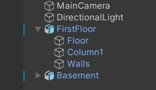

# Colivri Digital Twin

## About the Project

Colivri Digital Twin is a Unity-based project that aims to create a digital replica of the Colivri laboratory at the University of Los Andes. The project facilitates experimentation and the development of new technologies, emphasizing virtual and augmented reality, simulators, and human-robot interfaces. This initiative is led by a team of students as part of their degree project within the Systems Engineering program at the university.

### Organization of Objects and Naming Conventions in Unity

In this project, the organization of objects should be structured hierarchically for easy navigation and maintenance. We utilize the UpperCamelCase convention, which applies to all objects, classes, and structures within Unity. Please adhere to this convention when contributing to the project.

#### Naming Scheme: UpperCamelCase

The UpperCamelCase convention implies that the first letter of each word is capitalized without spaces.

#### Example



### Object Organization

Objects within Unity are organized in a clear hierarchical structure. In the example provided above, `FirstFloor` is a prefab, and `Floor`, `Column1`, `Walls` are child objects.

## Objectives

The primary objectives of the project are as follows:

1. Creating a precise virtual replica of the Colivri Laboratory in Unity.
2. Detailed representation of equipment, devices, and spaces within the laboratory.
3. Developing realistic and functional interactions with the television screens, allowing users to interact with them as a control center for the digital twin.
4. Exploring and optimizing the use of various virtual, augmented, and digital reality platforms for experiencing the Digital Twin.
5. Critically evaluating the effectiveness and utility of virtual television screens as essential components of the Digital Twin, particularly in terms of learning and simulation for students, professionals, and users of the Colivri Laboratory in the realm of virtual and augmented reality.

## Functionality

The ColivriDigitalTwin project offers the following key functionalities:

### Quick control of the laboratory

From a large format control panel, users can have a quick overview of all activities happening in the laboratory. This functionality enables:

- Intuitive control.
- Safety visualization.
- Functional simulation (audio).

### Show future configurations

The project also facilitates the display of future configurations, particularly on the screens, allowing:

- Intuitive control.
- Viewing from various platforms.

### AR - Adding information to the real world

In the context of Augmented Reality, the project enables users to view additional information about the equipment in the laboratory, including:

- Historical and real-time information viewing.
- Identification of points with critical information.
- Intuitive control.

## Getting Started

To get started with the project, please refer to the [official development documentation](https://imagine-uniandes.github.io/ColivriDigitalTwin/development/) for detailed information on the project structure, setup instructions, and development guidelines.

## Control Center (TVs Scene) Configuration

This section provides specific configurations for the Control Center (TVs Scene) in Unity. Follow these instructions to set up the Control Center environment effectively.

### 1. FMOD instructions for audio simulation

We have added FMOD to the gitignore to avoid conflicts with other scenes or devices. If you are running or building the TVs scene, follow these steps:

- Install the FMOD plugin from the Unity Package Manager.
- Follow the setup dialog window that FMOD suggests.
- Install the FMOD editor and link a project file with the 4 audio events for the audio screen.

### 2. Displays configuration information

To configure multiple displays in the Unity editor for the 8-display setup, follow these steps:

- Arrange displays in Unity as follows:
  - Display 2 in 1.1.
  - Display 3 in 1.2.
  - Display 4 in 1.3.
  - Display 5 in 2.1.
  - Display 6 in 2.2.
  - Display 1 in 2.3.
  - Display 7 in 3.1.
  - Display 8 in 3.2.
- Recommend having an additional monitor for virtual arranging of Unity editor game undocked windows.
- Use the Unity editor on your main monitor.
- At build, ensure you have the real 8 displays, and Unity will open automatically on each display with a specific camera.

**Unity Display Arrangement:**
```
   +---+---+---+
   | 2 | 5 | 7 |
   +---+---+---+
   | 3 | 6 | 8 |
   +---+---+---+
   | 4 | 1 | X |
   +---+---+---+
```

### 3. Using the Space Mouse Compact Controller with the TVs Screen

To use the Space Mouse Compact Controller with the TV screens in the ColivriDigitalTwin project, follow these steps:

1. Download the drivers of the device from the official website: [3Dconnexion Drivers](https://3dconnexion.com/us/drivers/).
2. Download vJoy, a virtual joystick driver, from the following link: [vJoy on SourceForge](https://sourceforge.net/projects/vjoystick/).
3. Follow the instructions provided in the GitHub repository for the integration: [Sx2vJoy-test GitHub Repository](https://github.com/Lasse-B/Sx2vJoy-test).
4. Disable the 3Dconnexion KMJ Emulator to prevent conflicts with executions. You can find a guide on how to disable it in this [tutorial](https://wrw.is/how-to-disable-the-3dconnexion-kmj-emulator-game-controller-to-fix-conflicts/).
5. Configure the buttons on the 3Dconnexion controller as follows: set the left button as "M" and the right button as "Enter" for optimal functionality.

## Development Team

The ColivriDigitalTwin project is being developed by a dedicated team, including:

<table>
  <tr>
    <td align="center" width="33%">
      <a href="https://github.com/pablo-figueroa-uniandes">
        
      </a>
    </td>
    <td align="center" width="33%">
      <a href="https://github.com/VivianGomez">
        
      </a>
    </td>
    <td align="center" width="33%">
      <a href="https://github.com/Juanes1516">
        
      </a>
    </td>
  </tr>
  <tr>
    <td align="center">
      Pablo Figueroa Forero
    </td>
    <td align="center">
      Vivian Gómez Cubillos
    </td>
    <td align="center">
      Juan Esteban Rodríguez
    </td>
  </tr>
  <tr>
    <td align="center" width="33%">
      <a href="https://github.com/Mecon0710">
        
      </a>
    </td>
    <td align="center" width="33%">
      <a href="https://github.com/zejiran">
        
      </a>
    </td>
    <td align="center" width="33%">
      <a href="https://github.com/julian27m">
        
      </a>
    </td>
  </tr>
  <tr>
    <td align="center">
      Melissa Lizeth Contreras Rojas
    </td>
    <td align="center">
      Juan Sebastián Alegría Zúñiga
    </td>
    <td align="center">
      Julian Camilo Mora Valbuena
    </td>
  </tr>
  <tr>
    <td align="center" width="33%">
      <a href="https://github.com/nFei">
        
      </a>
    </td>
    <td align="center" width="33%">
      <a href="https://github.com/Valentina1125">
        
      </a>
    </td>
    <td align="center" width="33%">
      <a href="https://github.com/abelarismendy">
        
      </a>
    </td>
  </tr>
  <tr>
    <td align="center">
      Nicolas Falla Bernal
    </td>
    <td align="center">
      Valentina Uribe
    </td>
    <td align="center">
      Abel Arismendy
    </td>
  </tr>
</table>

## License

[](http://badges.mit-license.org)

- **[MIT license](LICENSE)**
- Copyright 2023 © Grupo Imagine Uniandes
