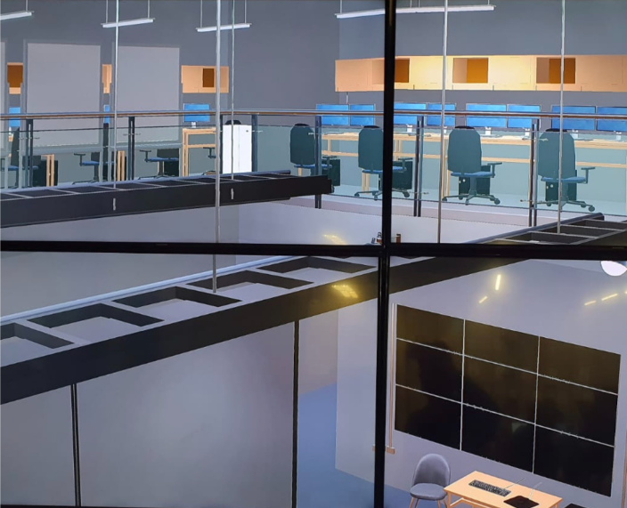
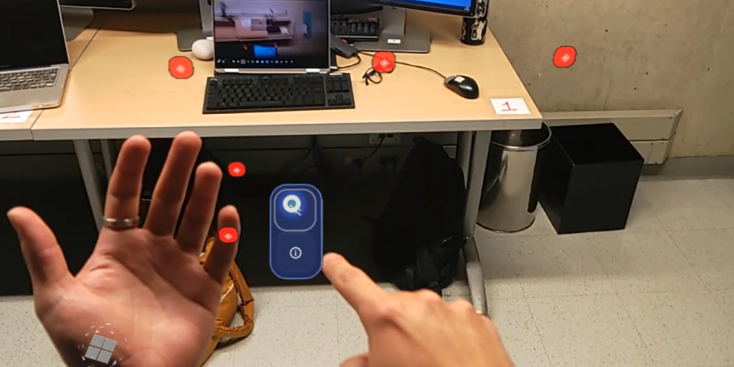
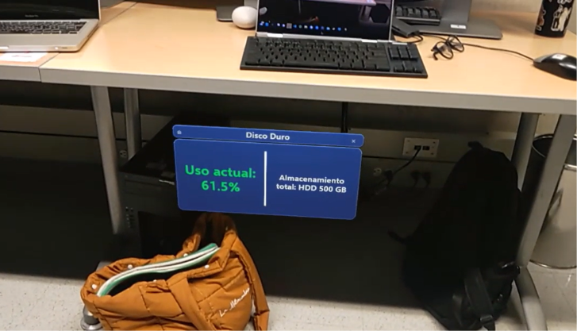
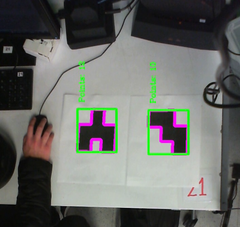
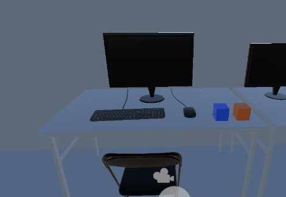

# Welcome to Colivri Digital Twin

Digital Twin Experimentation Space at Uniandes
Leveraging the potential of various mixed reality platforms

## **Objectives**

Colivri Digital Twin is created with several objectives in mind:

- **Experiment on GD:** Create useful functionality for laboratories at Uniandes.
- **Group work support:** With the support of the Dept., generate an infrastructure for the development of group degree projects.
- **Timeline of work:** Create an open platform that can be extensible over time.

## **Functionality**

### Quick control of the laboratory

From a large format control panel, you can have a quick view of everything that is happening in the laboratory

<iframe width="560" height="315" src="https://www.youtube.com/embed/WSYTl9xkJMU?si=Ul1zcydxgVj9dPRl" title="YouTube video player" frameborder="0" allow="accelerometer; autoplay; clipboard-write; encrypted-media; gyroscope; picture-in-picture; web-share" allowfullscreen></iframe>

- Total intuitive control
- Safety visualization
- Functionality simulation (audio)

### Show future configurations

*in this case, the screens*

<iframe width="560" height="315" src="https://www.youtube.com/embed/rL66HH_M_Tg?si=MPVqs--90dusA7vb" title="YouTube video player" frameborder="0" allow="accelerometer; autoplay; clipboard-write; encrypted-media; gyroscope; picture-in-picture; web-share" allowfullscreen></iframe>

- Total intuitive control
- View from various platforms

### AR - add information to the real world

In Augmented Reality, being able to see additional information about the equipment in front.

- See historical and dynamic information
- See the points that have more information
- Intuitive control

### Adittional information

- See information from other users, historical and in real time
- See dynamic environmental information (Position of chairs)
